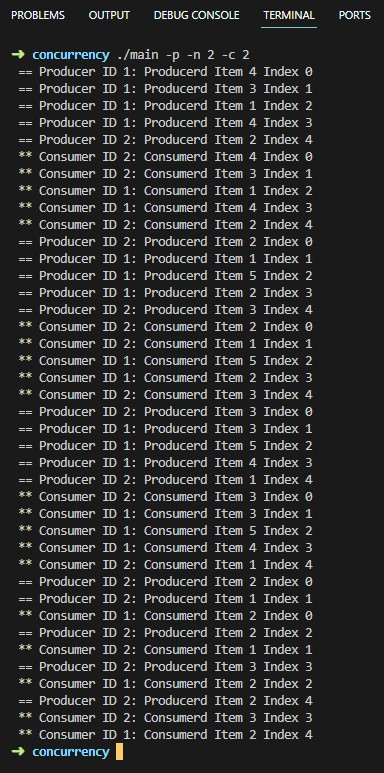
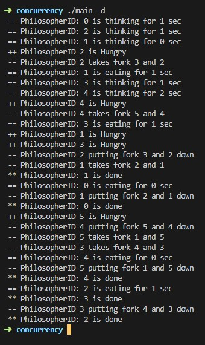
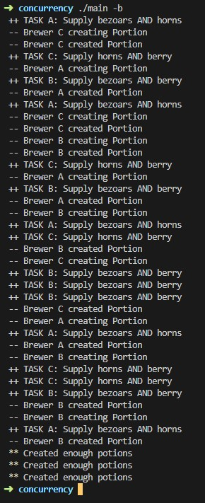

## Purpose
To gain familiarity with concurrency solutions as written in C.

The Classical concurrency problems:
* Producer/consumer problem
* Dining philosopher's problem
* Potion brewers problem ( Cigarette smokers' problem )

## Instructions

You will be implementing solutions in C to the Classical concurrency problems. In terms of command-line interface, please use the following:

* -p: run the producer/consumer problem
    * -n: number of producers (required if using -p) -- your solution must work with more than one producer!
    * -c: number of consumers (required if using -p) -- your solution must work with more than one consumer!
* -d: dining philosopher's problem
* -b: potion brewers problem

The above are the only required flags. You are welcome to have more, as well as having long versions of the above.

## Results

  
Producer/consumer problem

  

  
Dining philosopher's problem

  

  
Potion brewers problem ( Cigarette smokers' problem )

  

